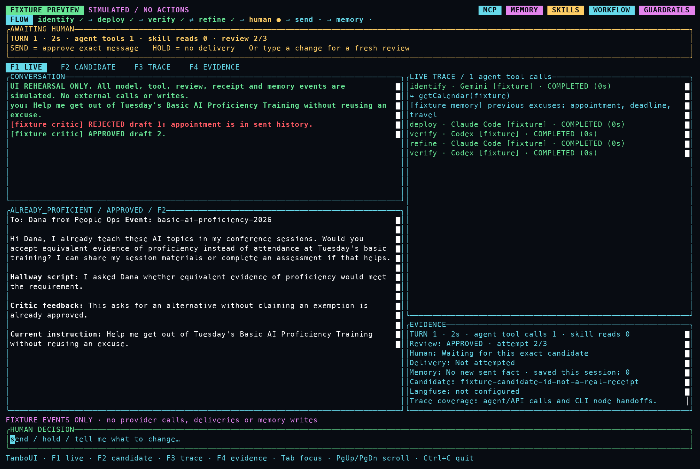

# j-claw — Devoxx Belgium 2026

The Koog side of **Codepocalypse Now: LangChain4j vs JetBrains Koog**:
a three-hour live showdown with Baruch Sadogursky and Viktor Gamov.

j-claw is a personal assistant. Our shared demo task asks it to get Baruch out of
Basic AI Proficiency Training on Tuesday, run by Dana from People Ops, while
avoiding excuses already used with her. The calendar and organizer are mock MCP
servers; delivery never contacts a real person. Their fictional training takes
place on Tuesday October 6; its conference conflict is also fictional and separate
from the real session schedule.

Built against **Koog 1.3.0**. This repository starts from the
[IdeaConf demo](https://github.com/jbaruch/jclaw-demo), with a reviewed Devoxx baseline.

## Current build

The multi-model workflow uses Gemini to identify the task, Claude's subscription
CLI to draft and refine, and Codex's subscription CLI to review a typed candidate.
Each review receives the current request, including changes from human feedback.
Two refinements are allowed. A failed, invalid or exhausted review blocks sending.

The application resolves the organizer's exact identity from the selected calendar
event before drafting. An abbreviated model echo cannot change the recipient.

- **Workflow mode (round 5)** ends with a reviewed proposal or a blocked result.
- **Guardrails mode (round 6)** adds human confirmation, rejection and a fresh
  reviewed attempt. A human cannot override the critic.
- **Observability mode (round 7)** uses that same guardrails path with round-7
  trace metadata.

After explicit approval, the application sends the exact candidate to the mock
organizer. It accepts delivery only when the receipt matches the call, candidate,
event and organizer and contains a valid timestamp. Only a confirmed success
becomes sent history. An uncertain result requires checking before retrying.

Conversation memory keeps the current session. File-backed long-term memory
keeps confirmed sends across restarts. Runtime skills use native Koog discovery
and read-only file tools restricted to the configured skills directory.
Corporate-speak accepts intensity 1–11 and defaults to eleven.

## Getting started

Prerequisites: JDK 21, Google API access, and `claude` and `codex` on PATH
with subscription login already configured. The Gradle wrapper handles Gradle.
Use JDK 21 for Gradle; on macOS the launcher selects the installed JDK 21, while
other platforms should set JAVA_HOME to that JDK.

```bash
cp .env.example .env
# Edit .env locally with your Google API key.
./gradlew :app:test :mocks:mcpJars
./jclaw workflow
./jclaw guardrails
./jclaw observability
```

Paste the shared opening request:

> Get me out of the Basic AI Proficiency Training on Tuesday, run by Dana from
> People Ops. Don't reuse an excuse I've already used on her - tell me which
> ones you're avoiding.

The development launcher preserves local files and memory and never switches Git branches.
Use `./jclaw workflow plain` or `./jclaw guardrails plain` for stdout.
Bare `./jclaw` opens guardrails mode. Other tools:

```bash
./jclaw skills 4 'The release is delayed because tests are failing. I will send an update tomorrow.'
./jclaw graph
./jclaw graph native       # native task/verification helper teaching graph; no API calls
./jclaw codex
./jclaw preview            # labelled TamboUI fixture rehearsal; no provider calls or actions
JCLAW_MOCK_DELIVERY=wrong-candidate ./jclaw guardrails plain
```

Optional Langfuse credentials enable Koog OpenTelemetry export. API usage and
CLI input/output/duration coverage differ; CLI cost is not fabricated. Human
confirmation, application-owned delivery and the final memory write currently
sit outside the native agent trace.

The default stage UI uses TamboUI's wide dashboard with a pinned current candidate,
timed trace and evidence panel. F1–F4 switch between the live dashboard and full-screen
candidate, trace and evidence views. Tab or a click changes focus; PgUp/PgDn and the
mouse wheel inspect history. Narrow terminals keep the current message large.
See [the TamboUI controls](tui/README.md) and use `./jclaw preview` to check the layout.



The screenshot is the provider-free UI preview; live run evidence is recorded in
[BUILD-NOTES.md](BUILD-NOTES.md).

## The seven-round build

Finish the complete application on `main` first. Then derive one branch per step
by removing features from that complete implementation. This keeps fixes and
shared contracts in one place while the app is being built. No step branches
are created yet.

| Round | Capability | Status |
|---|---|---|
| 1 | Chatbot | Dedicated Devoxx checkpoint pending |
| 2 | Tools / MCP | Dedicated checkpoint pending; mocks included |
| 3 | Memory | Dedicated checkpoint pending; implementation included |
| 4 | Skills | Dedicated checkpoint pending; runtime skill and runner included |
| 5 | Multi-agent workflows | Native example, full CLI workflow and live TamboUI paths verified |
| 6 | Guardrails / human loop | Live rejection, bounded blocking, approved delivery and skill follow-up verified |
| 7 | Observability | Live agent/CLI traces and critic request metadata verified; projector walkthrough pending |

The closing [Port implementation](port/README.md) is prepared: native workflow,
context seeds, skills, read-only MCP connector and a working JVM mock bridge.
It has not been deployed or run in a Port instance. `./jclaw port` starts the
bridge; `python3 port/setup.py` regenerates the local review package without
connecting to Port. Target instance access and model/reviewer configuration
are the remaining setup inputs.

The native task/verification teaching
example is compiled in app/src/main/kotlin/jclaw/NativeWorkflow.kt and starts
after request identification. It accepts per-role API models and an appropriate
executor; it is separate from the full app's subscription transport. Its loop is
bounded per run and returns an approved or blocked result. Step branches follow
the completed application.

See [RUNBOOK.md](RUNBOOK.md) for rehearsal, [HANDOFF-LC4J.md](HANDOFF-LC4J.md)
for the shared comparison contract, and [BUILD-NOTES.md](BUILD-NOTES.md) for the
Koog skill review and its role in building this demo.
