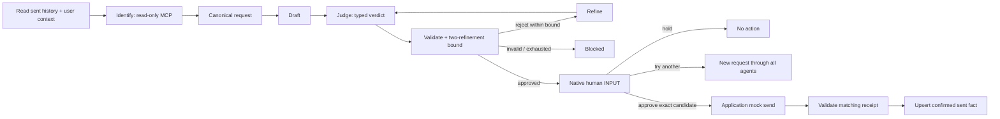

# The same workflow in Port

This is a prepared native Port workflow and a working local JVM mock bridge.
It has **not been deployed or run in a Port instance**. The target organization,
provider/model IDs and reviewer account are resolved after Baruch supplies access.

`preview/workflow.json` is the reviewable native graph. `prepare.py` regenerates
it, the blueprints, seed entities, skills, MCP connector and provenance manifest
from the app's actual fixture and skill files. The example configuration uses an
explicitly invalid host and example reviewer; it cannot be deployed accidentally.

The native path is:



The JSON expands two automatic refinement attempts and one human replacement into
a DAG. A second human replacement ends held and asks for a fresh request. This
finite outer bound differs from the JVM's ongoing conversation and should be
stated on stage. Port uses configured model APIs; the JVM draft/refine and critic
use Claude and Codex subscription CLIs. Do not present their costs or authentication
as equivalent. Port retrieves sent records with a deterministic catalog query;
the JVM uses embedded long-term retrieval.

The bridge calls the **same actual calendar and organizer MCP processes** as the
app. It shares canonical-recipient resolution, `reviewDecision`, candidate hashing,
the send envelope and raw MCP receipt validation. A signed reviewed-candidate token
binds the request, exact message, verdict, workflow run and call ID. The Port native
INPUT node attests who approved it. Only the action credential can invoke delivery;
the separate MCP credential exposes `getCalendar` and `getOrganizerSensitivity`.
Neither credential grants real messaging access: all delivery is mock delivery.

An SQLite ledger claims a send before calling the mock. A replay of a confirmed
call returns its original receipt; a previous uncertain attempt requires inspection
and is never resent automatically. Port writes sent history only after a confirmed
matching receipt. If the later catalog write fails, the run fails at the write;
the receipt still proves delivery. Do not narrate that as a failed send or rerun it
as a new action.

## Prepare and run locally

```bash
python3 port/setup.py             # local only; no Port connection
./gradlew :app:test :app:installDist :mocks:mcpJars
./jclaw port
```

Use JDK 21 for direct Gradle commands. The launcher chooses JDK 21 on macOS.
Supply three different random values of at least 32 characters in the ignored
`.env`: `JCLAW_PORT_READ_TOKEN`, `JCLAW_PORT_ACTION_TOKEN` and
`JCLAW_PORT_SIGNING_KEY`. The bridge listens on loopback port 8087. Choose an
HTTPS tunnel or host for the Port instance; no tunnel or cloud deployment is
started automatically. Keep the signing key and attempt ledger across restarts.
`JCLAW_PORT_ATTEMPTS` can put that ledger in a dedicated persistent directory.

The read-only reference-client check uses Node.js and MCP SDK 1.31.0. With the
bridge running, load the same read credential into the shell environment, then
run `npm ci --prefix port/reference-client` followed by
`npm run probe --prefix port/reference-client`. It makes two reads and cannot send.

## Set up after instance access

1. Create `port/generated/`, then copy `port/config.example.json` to ignored
   `port/generated/config.json`. Set the API
   region, HTTPS bridge URL and actual reviewer email. Keep client credentials in
   the local environment, never in this configuration or Git.
2. `python3 port/setup.py --config port/generated/config.json --inspect` reads the
   organization identity. Set `expectedOrgId` to that exact ID. If using Port MCP,
   verify its user/organization identity separately: REST client credentials and a
   user's MCP session can point at different organizations.
3. Discover configured provider/model IDs in the target organization and set each
   role to `{"provider":"actual-provider-id","model":"actual-model-id"}`.
   Review the [AI node configuration](https://docs.port.io/workflows/build-workflows/nodes/action-nodes/ai/)
   and [provider API](https://docs.port.io/api-reference/get-configured-llm-providers/).
4. `python3 port/setup.py --config port/generated/config.json --apply` seeds only
   the j-claw resources and two namespaced skills. Existing blueprints must be
   compatible; it never replaces a shared schema or deletes another demo's data.
   Existing secret names are retained and must match the local bridge. The script
   checks bulk response errors, including HTTP 207 partial success.
   Secret creation uses the documented `secretName`/`secretValue` body in Port's
   [secret setup example](https://docs.port.io/guides/all/map-external-users-and-teams-to-port-accounts/).
5. Connect and publish `jclaw-read` under MCP Servers with shared organization
   header authentication. The allowlist uses Port names
   `jclaw-read_getCalendar` and `jclaw-read_getOrganizerSensitivity`. Check the
   **cached tool count**, not only `usable: true`.
6. `python3 port/preflight.py --config port/generated/config.json` verifies the
   seeded facts, stored graph, connector availability and exact read-only tools.
   Then rehearse the native graph in that instance; local validation is not a Port
   execution or schema-acceptance claim.

The four calendar events and three historical excuses are fictional shared seeds;
they are not Baruch's actual Devoxx calendar. Additional confirmed sends remain
durable. Seeding does not clear them or reset the local attempt ledger.

The corporate-speak body is copied from `skills/corporate-speak/SKILL.md` and stays
separate from the review skill. The latter is loaded by Judge through `load_skill`.
The [current skill schema](https://docs.port.io/agent-management/ai-registry/skills/overview/)
includes `location`; the older Printf demo's custom blueprint omitted it. An
existing incompatible skill blueprint needs an additive reconciliation in the
target instance, not a blind overwrite.

AI tool lists are explicit. Draft/refine use a regex that matches no tool name;
Identify gets only the two read tools; Judge gets `load_skill`.
An empty list permits all native tools and attached MCP tools. Native INPUT
notifications are explicitly `[]`, which disables default notifications; this
demo needs no Slack or email. Both behaviors are documented in the
[AI node](https://docs.port.io/workflows/build-workflows/nodes/action-nodes/ai/) and
[INPUT node](https://www.docs.port.io/workflows/build-workflows/flow-nodes/input/).

## Five-minute closing run

Open the prepared native workflow and state the model/authentication and finite
graph differences. Show the shared task and actual history query, the current
request entering Judge, and the exact message at native human review. Approve one
candidate, inspect the matched organizer receipt, then open its durable sent fact.
If latency threatens the slot, show a completed run labelled **PREPARED RUN**.
The full rejection/replacement lesson has already happened in guardrails.

Before calling Port stage-ready, verify first-draft approval, actual critic
rejection/refinement, exhausted review, held candidate, human replacement through
all stages, approved exact delivery, wrong/failed receipt without history, and the
delivery-versus-catalog-write failure distinction. Dashboard and sidebar polish
can follow the target Port page schema; no unrelated Printf pages are altered.
