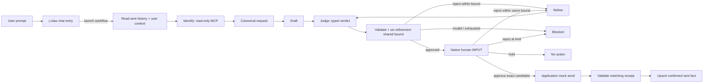

# The same workflow in Port

The native workflow is deployed in the **J-Claw** demo organization. The updated
two-critic graph has completed a live run: human rejection → shared Refine → Judge
approval → fresh human approval → exact-candidate mock delivery → durable catalog
write. That recorded run used the earlier two-refinement policy; Identify ran once
and one shared refinement was used. The current deployed workflow and bridge now
share six refinements / seven candidates and pass read-only preflight. The current
version also completed a native browser rehearsal on candidate seven: two Judge
and four Human rejections spent all six refinements, Identify ran once, and one
mock receipt matched one new sent fact. See [the current-bound evidence](validation/six-refinements.json).
The existing four catalog records were preserved. Human caught Judge accepting a
conference clash relabelled as DEADLINE, then explicitly added a separate fictional
preparation deadline. The accepted result depends on that added rehearsal fact;
it does not prove the original request alone produced an acceptable new excuse. An independent
catalog read matched the stored message, recipient and receipt. Earlier runs also
verified model rejection/refinement and a native Hold with no action. Stable hosting,
failed-receipt paths and a timed stage rehearsal are still pending. The version
with declared agents also completed two refinements and blocked at its then-configured limit.

The configured models are Port-managed Sonnet 4.6 for the chat entry and Identify, Opus 4.6 for
Draft/refine and GPT-5 for Judge. The bridge currently uses a temporary Cloudflare
Quick Tunnel. Keep it running; restart changes its hostname. A stable endpoint
and a timed run remain necessary before the stage demo.

The [completed current-bound run](https://app.port.io/org_LPlEwoGPsLYRbgGB/organization/workflow-run?runId=wfr_zJUi8df41Svu5xK0)
is the prepared example for the closing. Its full refinement exercise took about
nineteen minutes including browser navigation and review waits; summed model-node
durations were about seven minutes. Neither is a five-minute stage timing result.
DEADLINE is now also used for Dana. A repeated baseline request must honor that
record. Use a clearly labelled completed run or explicit fresh fictional facts;
do not silently reset history to force the previous output.

`preview/workflow.json` is the reviewable native graph. `prepare.py` regenerates
it, the Home widgets, chat page, agent declarations, blueprints, seed entities, skills, MCP connector and provenance manifest
from the app's actual fixture and skill files. The example configuration uses an
explicitly invalid host and example reviewer; it cannot be deployed accidentally.

The AI Agents catalog contains four active declarations from
[`preview/agents.json`](preview/agents.json):

| Agent | Model in J-Claw | Configured tool allowlist |
|---|---|---|
| j-claw (chat entry) | Sonnet 4.6 | Workflow discovery, launch and status |
| j-claw · Identify | Sonnet 4.6 | Calendar and organizer MCP reads |
| j-claw · Draft & Refine | Opus 4.6 | `^$` (matches no tool name) |
| j-claw · Judge | GPT-5 | `load_skill` |

Draft, all six Refine steps and each Judge invoke their declared agents using native
`AI_AGENT` nodes with typed output schemas. Identify's workflow node is generated
from its declaration's prompt, tools, model and MCP relation. Port requires a
workflow `AI` node for automated external MCP; agent MCP works in interactive chat
with a connected user. See [Port's AI node modes](https://docs.port.io/workflows/build-workflows/nodes/action-nodes/ai/)
and [agent MCP configuration](https://docs.port.io/agent-management/custom-agents/build-an-ai-agent/#step-4-configure-mcp-server-access).
The human is critic two, represented by native INPUT nodes.
The observed run also records `load_skill` calls during Identify and Draft despite
those stored patterns. BUILD-NOTES.md records actual tool use alongside configuration.

Identify was upgraded from Haiku after a rehearsal stopped at canonicalization:
Haiku discovered tools but skipped the actual calls and invented an event ID.
Its declaration now explicitly requires both reads and copying the returned ID.

The fresh J-Claw organization's four starter agents (DORA Insights, Reliability,
Delivery Performance and Standards Insights) were removed on request. Their full
declarations are backed up in ignored `port/generated/`. Ordinary setup upserts
the four j-claw agents and retains other catalog records.

## Start with a prompt

Open [J-Claw Home](https://app.port.io/org_LPlEwoGPsLYRbgGB/organization/home).
Its **Ask j-claw** widget is bound to the registered
`jclaw` entry agent. Click the opening-request conversation starter, which submits
immediately, or paste the same request used in the terminal:

> Get me out of the Basic AI Proficiency Training on Tuesday, run by Dana from
> People Ops. Don't reuse an excuse I've already used on her - tell me which
> ones you're avoiding.

The entry agent discovers the self-service trigger and launches the workflow
with the complete request unchanged. It returns the actual run link. Verify a
new `jclaw_decline` run exists: calendar reads or a draft in the chat alone do not
prove workflow execution. Review,
reject, hold or approve in that run's native human panel; feedback continues the
same bounded run. The entry agent does not approve or send. The direct self-service
form is also available through Home's workflow card. Home shows the three worker
agents with model IDs and the two demo skills in scoped, linked catalog tables.
Expand the chat widget for a large stage
view; **Reset conversation** starts a fresh chat. Workflow-launch tool approval,
if shown, is separate from approving the exact organizer message. See
[AI Chat widgets](https://docs.port.io/agent-management/custom-agents/interact-with-ai-agents/)
and [workflows as agent tools](https://docs.port.io/workflows/expose-as-tool/).

[`preview/dashboard.json`](preview/dashboard.json) defines the deployed native
AI Chat page. The current generic **Build anything** chat's **+** menu offers
Prompts, Port Tools and Connectors, with no AI Agents selector. Selecting the
read-only connector there leaves the default assistant in charge, which drafted
inline in the earlier rehearsal. Use the dedicated page for the demo.

The machine-token MCP session refused organization-page creation, so the signed-in
Admin created the page shell; Port MCP then added the bound widget. Browser
verification launched a real workflow with the exact request. That run exhausted
the shared refinement limit and blocked without delivery or a history write;
see [the recorded evidence](../BUILD-NOTES.md#port-chat-page-and-browser-verification).

[`preview/home.json`](preview/home.json) defines the four deployed Home widgets:
workflow card and chat across the first row, agents and skills across the second.
The same bound chat remains available on the [dedicated j-claw page](https://app.port.io/org_LPlEwoGPsLYRbgGB/jclaw-demo).
Home's starter widgets were backed up before replacement. The worker table lists
Identify's declaration alongside Draft/Refine and Judge; Identify's automated
workflow node still uses the shared configuration described above.

The native path is:



The human is the second critic. Either rejection reaches the same Refine step,
then returns through Judge and human review. Identify runs once; the request,
feedback and shared six-refinement count survive both rejection paths. Rejection
at the limit blocks. Hold stops with no action. The JSON expands this same bounded
loop into a DAG; the JVM uses graph backedges. Port uses configured model APIs;
the JVM draft/refine and critic use Claude and Codex subscription CLIs. Do not
present their costs or authentication
as equivalent. Port retrieves sent records with a deterministic catalog query;
the JVM uses embedded long-term retrieval. Port keeps Sonnet for Identify; the JVM
uses Jev plus application code. The decision transport differs, while the canonical
request and approval contracts remain shared.

The bridge calls the **same actual calendar and organizer MCP processes** as the
app. It shares canonical-recipient resolution, `reviewDecision`, candidate hashing,
the send envelope and raw MCP receipt validation. A signed reviewed-candidate token
binds the request, exact message, verdict, workflow run and call ID. The Port native
INPUT node attests who approved it. Only the action credential can invoke delivery;
the separate MCP credential exposes `getCalendar` and `getOrganizerSensitivity`.
Neither credential grants real messaging access: all delivery is mock delivery.

An SQLite ledger claims a send before calling the mock. A replay of a confirmed
call returns its original receipt; a previous uncertain attempt requires inspection
and is never resent automatically. Port writes sent history only after a confirmed
matching receipt. If the later catalog write fails, the run fails at the write;
the receipt still proves delivery. Do not narrate that as a failed send or rerun it
as a new action.

## Prepare and run locally

```bash
python3 port/setup.py             # local only; no Port connection
./gradlew :app:test :app:installDist :mocks:mcpJars
./jclaw port
```

Use JDK 21 for direct Gradle commands. The launcher chooses JDK 21 on macOS.
Supply three different random values of at least 32 characters in the ignored
`.env`: `JCLAW_PORT_READ_TOKEN`, `JCLAW_PORT_ACTION_TOKEN` and
`JCLAW_PORT_SIGNING_KEY`. The bridge listens on loopback port 8087. Choose an
HTTPS tunnel or host for the Port instance; no tunnel or cloud deployment is
started automatically. Keep the signing key and attempt ledger across restarts.
`JCLAW_PORT_ATTEMPTS` can put that ledger in a dedicated persistent directory.

The read-only reference-client check uses Node.js and MCP SDK 1.31.0. With the
bridge running, load the same read credential into the shell environment, then
run `npm ci --prefix port/reference-client` followed by
`npm run probe --prefix port/reference-client`. It makes two reads and cannot send.

## Set up after instance access

1. Create `port/generated/`, then copy `port/config.example.json` to ignored
   `port/generated/config.json`. Set the API
   region, HTTPS bridge URL and actual reviewer email. Keep client credentials in
   the local environment, never in this configuration or Git.
2. `python3 port/setup.py --config port/generated/config.json --inspect` reads the
   organization identity. Set `expectedOrgId` to that exact ID. If using Port MCP,
   verify its user/organization identity separately: REST client credentials and a
   user's MCP session can point at different organizations.
3. The example records the J-Claw lineup: Port-managed Sonnet 4.6 for the chat entry and Identify,
   Opus 4.6 for Draft/refine and GPT-5 for Judge. Discover configured provider/model
   IDs in your target organization and verify these choices are enabled, or set each
   role to `{"provider":"actual-provider-id","model":"actual-model-id"}`.
   Review the [AI node configuration](https://docs.port.io/workflows/build-workflows/nodes/action-nodes/ai/)
   and [provider API](https://docs.port.io/api-reference/get-configured-llm-providers/).
4. `python3 port/setup.py --config port/generated/config.json --apply` seeds only
   the j-claw resources, four agent declarations and two namespaced skills. Existing blueprints must be
   compatible; it never replaces a shared schema or deletes another demo's data.
   Existing secret names are retained and must match the local bridge. The script
   checks bulk response errors, including HTTP 207 partial success.
   Secret creation uses the documented `secretName`/`secretValue` body in Port's
   [secret setup example](https://docs.port.io/guides/all/map-external-users-and-teams-to-port-accounts/).
5. Connect and publish `jclaw-read` under MCP Servers with shared organization
   header authentication. The allowlist uses Port names
   `jclaw-read_getCalendar` and `jclaw-read_getOrganizerSensitivity`. Check the
   published allowlist and tools returned by `/mcp/servers/jclaw-read/tools`.
   `/mcp/user/servers` describes the calling identity and can report `usable: false`
   while the workflow's shared-header connector works. Verify actual calls in the
   AI invocation logs; finding definitions with `search_tools` is not a read.
6. Create the native chat page from `preview/dashboard.json` using an authorized
   user MCP session. Check page permissions and append it after the last sidebar
   page. If machine-token MCP refuses page creation, create the `jclaw-demo`
   dashboard shell in the signed-in Admin UI, then use `upsert_widget` with the
   definition's `jclaw-chat` widget. `setup.py --apply` does not deploy this page.
   To reproduce Home, read and back up the existing Home page, then update it with
   the widgets and layout in `preview/home.json`; do not create a second Home.
   In J-Claw its stored identifier is `$home`. An authorized user MCP session can
   update the page. Machine-token MCP can upsert the individual widgets; if its
   page-upsert permission check refuses the update, the documented
   [widget PATCH API](https://docs.port.io/api-reference/update-a-widget/) can
   arrange the existing dashboard container. `setup.py --apply` does not deploy
   Home either.
7. `python3 port/preflight.py --config port/generated/config.json` verifies the
   seeded facts, stored graph, connector availability and exact read-only tools.
   Then open the bound chat widget and verify an actual workflow launch before
   rehearsing the native graph; local validation is not a Port execution or
   schema-acceptance claim.

The four calendar events and three historical excuses are fictional shared seeds;
they are not Baruch's actual Devoxx calendar. Additional confirmed sends remain
durable. Seeding does not clear them or reset the local attempt ledger.

The corporate-speak body is copied from `skills/corporate-speak/SKILL.md` and stays
separate from the review skill. The latter is loaded by Judge through `load_skill`.
The [current skill schema](https://docs.port.io/agent-management/ai-registry/skills/overview/)
includes `location`; the older Printf demo's custom blueprint omitted it. An
existing incompatible skill blueprint needs an additive reconciliation in the
target instance, not a blind overwrite.

AI tool lists are explicit in the declarations. Draft/refine use a regex that
matches no tool name; Identify gets only the two read tools; Judge gets `load_skill`.
An empty list permits all native tools and attached MCP tools. Native INPUT
notifications are explicitly `[]`, which disables default notifications; this
demo needs no Slack or email. Both behaviors are documented in the
[AI node](https://docs.port.io/workflows/build-workflows/nodes/action-nodes/ai/) and
[INPUT node](https://www.docs.port.io/workflows/build-workflows/flow-nodes/input/).

The organizer message is sent verbatim. Draft and Judge must keep user-facing
notes out of both message and hallway script. The human panel displays the
avoided sent flavors and proposed alternatives separately. A live rehearsal
caught an internal aside inside the email field after critic approval; inspect
the exact candidate at the human gate even when the critic approved it.

Connect Codex with `codex mcp add port-eu --url https://mcp.port.io/v1` and complete
OAuth for J-Claw. A running Codex session may need restarting to expose newly
registered tools. The MCP workflow tools can update and trigger the graph; the
currently available tool set does not answer native INPUT nodes. Respond in Port
as the configured reviewer, then use `get_run` to inspect delivery and history.

## Five-minute closing run

Open the prepared native workflow and state the model/authentication differences
and the two representations of the same bounded loop. Show the shared task and actual history query, the current
request entering Judge, and the exact message at native human review. Approve one
candidate, inspect the matched organizer receipt, then open its durable sent fact.
If latency threatens the slot, show a completed run labelled **PREPARED RUN**.
The full two-critic rejection lesson belongs in guardrails.

Before calling Port stage-ready, verify first-draft approval, actual critic
rejection/refinement, exhausted review, held candidate, human rejection through
the same Refine and both critics without another Identify, approved exact delivery,
wrong/failed receipt without history, and the
delivery-versus-catalog-write failure distinction. Dashboard and sidebar polish
can follow the target Port page schema; no unrelated Printf pages are altered.
